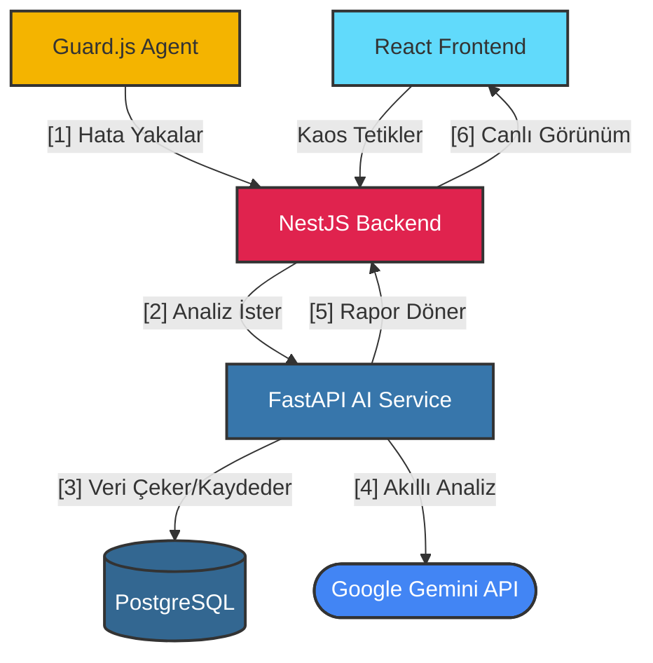
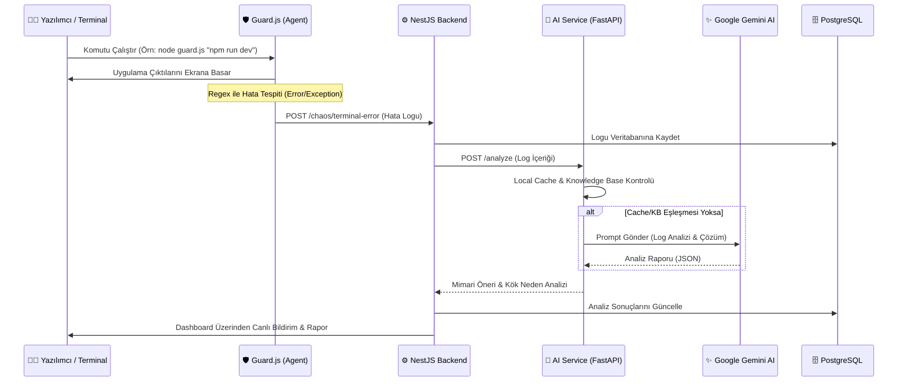
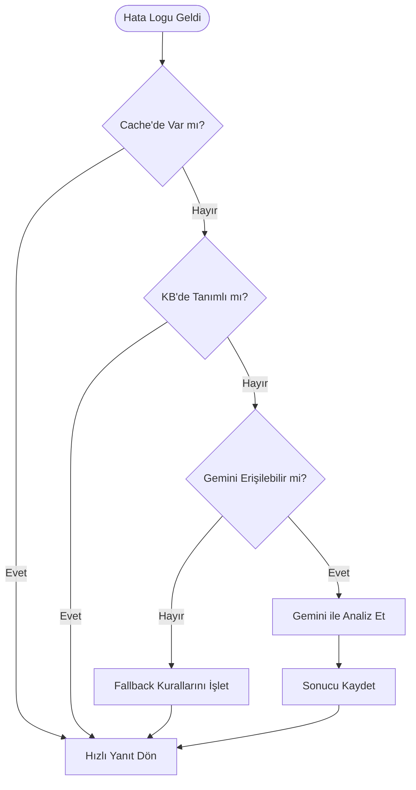

# 🛡️ ResiliEngine
### Yapay Zekâ Destekli Kaos Mühendisliği (Chaos Engineering) Platformu

<div align="center">
  
  
  
  
  
</div>

---

## 🚀 Proje Genel Bakış

**ResiliEngine**, bulut tabanlı ve servis odaklı mimariler (SOA) için tasarlanmış yenilikçi bir **Kaos Mühendisliği (Chaos Engineering)** platformudur. Sistemlerin beklenmedik hatalara (ağ gecikmeleri, servis çökmeleri, veritabanı bağlantı kopmaları) karşı ne kadar dayanıklı olduğunu ölçmek amacıyla sisteme bilinçli ve kontrollü arızalar (hata enjeksiyonu) verir.

Sadece hataları enjekte etmekle kalmaz, entegre **Yapay Zekâ (Gemini AI)** desteğiyle sistemin bu hatalara verdiği tepkileri analiz ederek, darboğazları tespit eder ve geliştiricilere doğrudan kullanılabilecek mimari iyileştirme önerileri (Root Cause Analysis) sunar.

---

## 🛠️ Teknik Mimari & Çalışma Akışı

ResiliEngine, sağlam ve ölçeklenebilir bir mikroservis yapısı üzerine inşa edilmiştir.

### 🧱 Sistem Bileşenleri


### 🔄 Çalışma Akışı


---

## 🌟 Öne Çıkan Özellikler

*   **🛡️ Guard.js (Canlı Terminal Gözcüsü):** Yazılımcıların terminal akışlarını izleyen, bir hata (`Error`, `Exception` vb.) yakaladığı anda anında sunucuya raporlayan Node.js tabanlı canlı izleme ajanı.
*   **🧪 Dinamik Hata Enjeksiyonu (Strategy Pattern):** Sistemlerin dayanıklılığını ölçmek amacıyla `Latency`, `429`, `401` ve `500` hataları fırlatabilen modüler kaos motoru.
*   **🧠 Hibrit Yapay Zekâ Hattı:**
    Sistem, verimlilik ve maliyet optimizasyonu için kademeli bir analiz mantığı yürütür:



    1.  **L1 - Veritabanı Cache:** Daha önce analiz edilmiş benzer hatalar milisaniyeler içinde çekilir.
    2.  **L2 - Knowledge Base:** Sık karşılaşılan DevOps ve kodlama hataları için yerel uzman kütüphanesi.
    3.  **L3 - Bulut AI (Gemini):** Güncel ve gelişmiş mimari analizler için Google Gemini 2.0 Flash entegrasyonu.
    4.  **L4 - Fallback Engine:** Tüm sistemler çevrimdışı olsa bile devreye giren akıllı DevOps asistanı.

---

## 🚦 Kurulum & Çalıştırma Rehberi

### 1. Docker Konteynerlarını Başlatma
Tüm mikroservis mimarisini ayağa kaldırmak için terminalde çalıştırın:
```bash
docker-compose up -d
```
*Not: Sistem Docker üzerinden `frontend (5173)`, `backend (3000)`, `ai-service (8000)` ve `PostgreSQL` veritabanını yönetir.*

### 2. Canlı Takip Ekranı
Tarayıcınızdan **http://localhost:5173** adresine giderek Dashboard'u açın. Ekranda yeşil renkle yanıp sönen **"Aktif İzleme Devrede"** panelini görün.

### 3. Gerçek Zamanlı Hata Yakalama (Demo)
Bir yazılımcının sistemde hata yaptığını simüle etmek için yeni bir terminalde şu komutu çalıştırın:

```bash
node guard.js "echo [ERROR] Fatal: Database deadlocked in /src/database.ts"
```

*Komut çalıştıktan 2-3 saniye sonra Dashboard ekranına anında hatanın düştüğünü ve Yapay Zeka'nın Türkçe bir dille mimari çözüm ürettiğini göreceksiniz.*

---

## 📊 Deployment Bilgileri

| Servis / Bileşen | Teknoloji | Durum |
| :--- | :--- | :---: |
| **Frontend (UI)** | React / Vite | 🟢 Aktif |
| **Backend (API)** | NestJS | 🟢 Aktif |
| **AI Service** | Python / FastAPI | 🟢 Aktif |
| **Database** | Managed PostgreSQL | 🟢 Aktif |

---
<div align="center">
  <sub>ResiliEngine - Kaosun İçindeki Düzeni Keşfedin.</sub>
</div>


