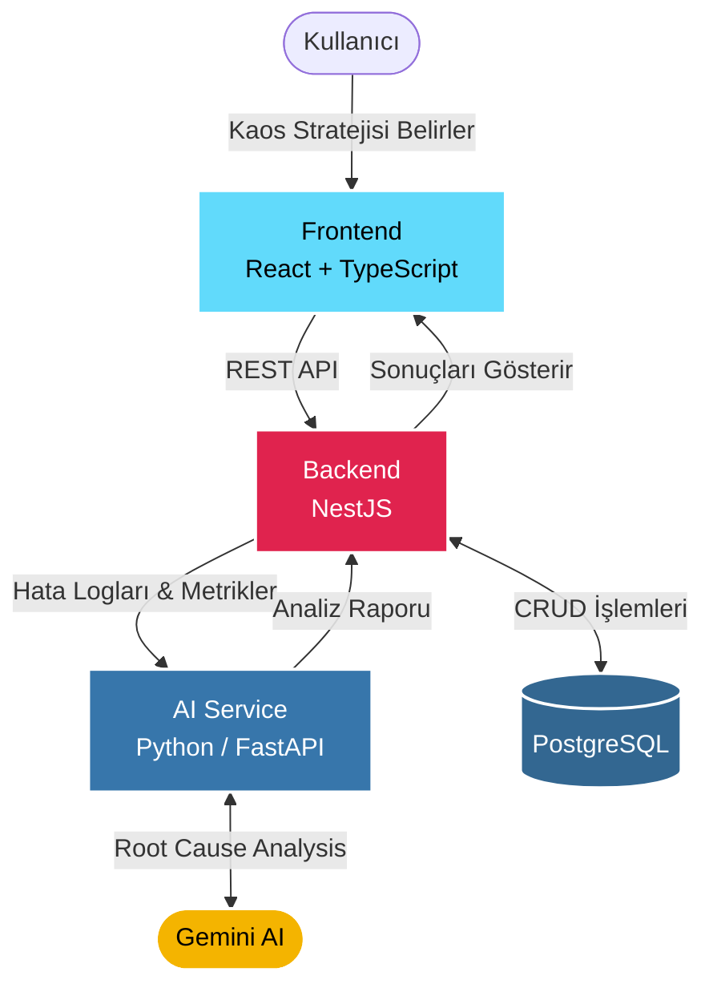

# ResiliEngine

<div align="center">
  <h3>Yapay Zekâ Destekli Kaos Mühendisliği (Chaos Engineering) Platformu</h3>
</div>

---

## Project Overview

**ResiliEngine**, bulut tabanlı ve servis odaklı mimariler (SOA) için tasarlanmış yenilikçi bir **Kaos Mühendisliği (Chaos Engineering)** platformudur. Sistemlerin beklenmedik hatalara (ağ gecikmeleri, servis çökmeleri, veri tabanı bağlantı kopmaları) karşı ne kadar dayanıklı olduğunu ölçmek amacıyla sisteme bilinçli ve kontrollü arızalar (hata enjeksiyonu) verir. 

Sadece hataları enjekte etmekle kalmaz, entegre **Yapay Zekâ (Gemini AI)** desteğiyle sistemin bu hatalara verdiği tepkileri analiz ederek, darboğazları tespit eder ve geliştiricilere doğrudan kullanılabilecek mimari iyileştirme önerileri (Root Cause Analysis) sunar.

## System Architecture

ResiliEngine, sağlam ve ölçeklenebilir bir mikroservis yapısı üzerine inşa edilmiştir.



## Key Features

- **Dinamik Hata Enjeksiyonu (Strategy Pattern):** Sistem çalışma esnasında dinamik olarak farklı hata stratejilerini (`LatencyInjection`, `ServiceCrash`, `DatabaseTimeout`) seçip uygulayabilmeyi sağlayan esnek mimari.
- **Yapay Zeka Destekli Kök Neden Analizi (Root Cause Analysis):** Sisteme enjekte edilen hataların oluşturduğu logları `Gemini AI` ile analiz edip otomatik raporlar ve kod bazlı çözüm yolları üretilmesi.
- **Bulut Tabanlı Dağıtık Mimari:** Mikroservis mimarisine uygun olarak, frontend, backend ve AI servisinin bağımsız konteynerlar (Docker) üzerinden birbiriyle entegre çalıştığı modern bulut yaklaşımı.

## Deployment Links

Yayınlanan mikroservis ve bileşenlerimizin canlı ortam bağlantıları aşağıdadır (Render üzerinden host edilmektedir):

| Servis / Bileşen | Teknoloji | Canlı Link (Render) | Durum |
| :--- | :--- | :--- | :---: |
| **Frontend (UI)** | React / Vite | [resiliengine-frontend.onrender.com](https://resiliengine-frontend.onrender.com) | 🟢 Aktif |
| **Backend (API)** | NestJS | [resiliengine-backend.onrender.com](https://resiliengine-backend.onrender.com) | 🟢 Aktif |
| **AI Service** | Python / FastAPI | [resiliengine-ai.onrender.com](https://resiliengine-ai.onrender.com) | 🟢 Aktif |
| **Database** | Managed PostgreSQL | *[Dış erişime kapalı, iç ağda]* | 🟢 Aktif |

> *Not: Proje ortamları hazırlandıkça linkler test edilebilir hale gelecektir.*

## How to Run (Local)

Projeyi kendi bilgisayarınızda (lokal ortamda) tüm bileşenleriyle tek tuşla çalıştırmak için **Docker** kullanıyoruz.

1. Projeyi sisteminize indirin:
   ```bash
   git clone <repo-url>
   cd ResiliEngine
   ```

2. Ortam değişkenlerini (Env) ayarlayın:
   Ana dizinde yer alan `.env` dosyasının doğru yapılandırıldığından emin olun (örn. `GEMINI_API_KEY` vb.).

3. Konteynerları ayağa kaldırın:
   Tüm servisleri inşa edip başlatmak için aşağıdaki komutu çalıştırın:
   ```bash
   docker-compose up --build
   ```
   
> **`docker-compose up --build` nedir?**
> Bu komut, projeyi çalıştırmak için gerekli olan `docker-compose.yml` dosyasını okur. İçerisinde tanımlı olan tüm servislerin (Frontend, Backend, AI Service, PostgreSQL veritabanı) imajlarını proje dosyalarından sıfırdan oluşturur (build aşaması). Ardından bu sanal konteynerların kendi aralarında iletişim kurabileceği ağ yapılandırmalarını (network) otomatik olarak kurup hepsini senkronize bir şekilde çalıştırır (up aşaması). Her sistemi tek tek bilgisayarına kurmak yerine bu komut sayesinde izole ve eksiksiz bir ortam elde edersin.
